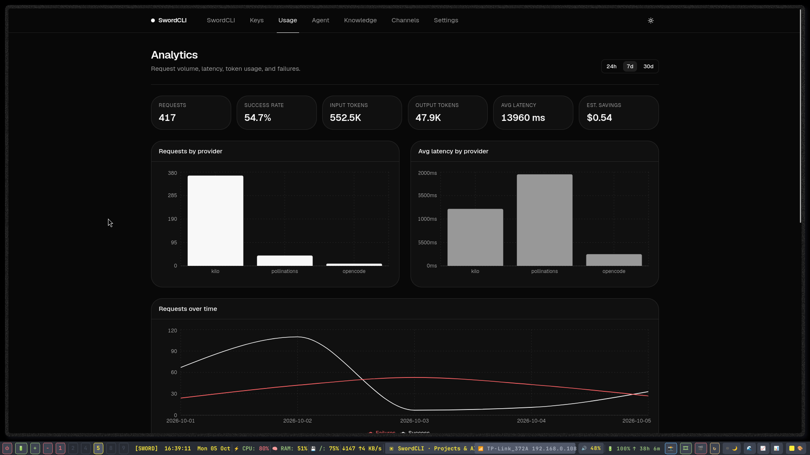
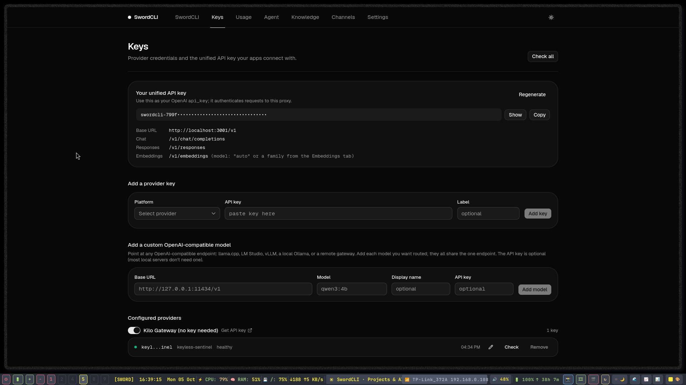
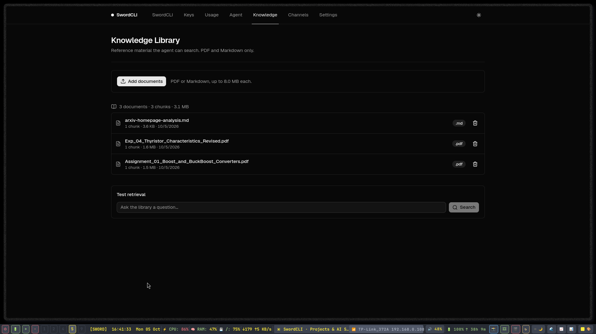
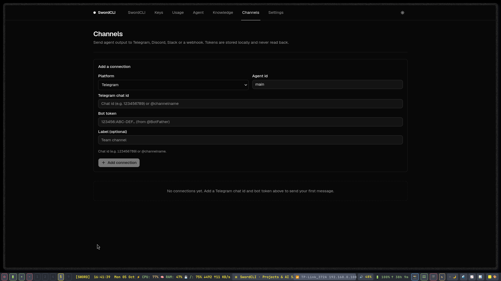
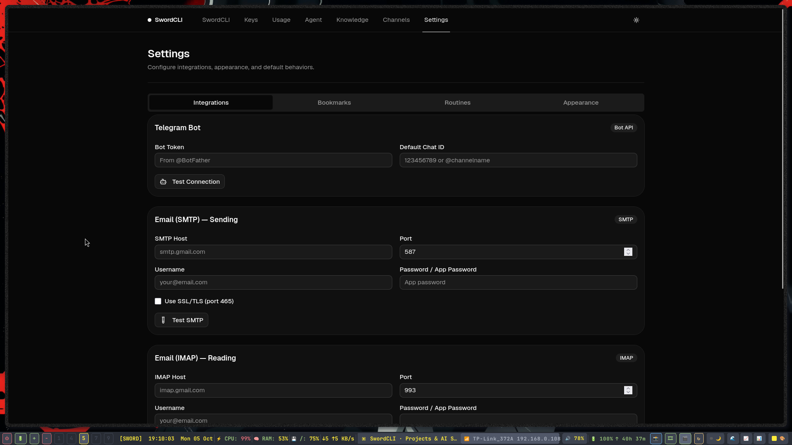
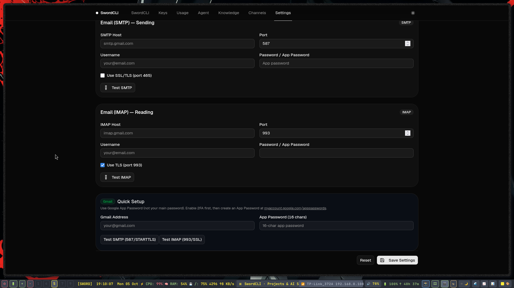

<div align="center">
  <h1>🗡️ SwordCLI (Character-Flow)</h1>
  <p><strong>Advanced Multi-Agent AI Coding Assistant & Terminal REPL</strong></p>

  [](https://opensource.org/licenses/MIT)
  [](https://nodejs.org/)
  [](http://makeapullrequest.com)

  <p>
    An intelligent, context-aware command-line AI assistant powered by multiple LLM providers, Model Context Protocol (MCP), dynamic character personas, and multi-agent teamwork architectures. 
  </p>
</div>

---

## 🚀 Why SwordCLI?

**SwordCLI** (formerly Character-Flow) bridges the gap between your local development environment and advanced AI reasoning. It operates entirely within your terminal, utilizing a robust interactive REPL with rich tab-completion, persistent local sessions, and a built-in fallback system that ensures you always have an AI provider available—even for free.

Whether you need a **Local AI coding assistant**, a **multi-agent workflow orchestrator**, or a seamless way to integrate **Model Context Protocol (MCP)** tools, SwordCLI provides a hardened, developer-first experience.

## ✨ Key Features (SEO Optimized capabilities)

- 🤖 **Multi-Provider LLM Routing**: Supports OpenAI-compatible endpoints, custom remote Sword backends, and includes a **free built-in fallback provider (g4f)** so you are never left without AI.
- 👥 **Multi-Agent Teamwork Mode**: Enable `/team` to spin up a round-robin discussion between specialized agent personas to tackle complex architectural problems.
- 🔌 **Model Context Protocol (MCP) Integration**: Natively discover, configure, and invoke external MCP servers directly from the CLI (`sword mcp list`, `sword mcp add`).
- 🧠 **RAG & Web Search Engine**: Built-in retrieval-augmented generation and live DuckDuckGo web search to pull in current documentation and internet context without leaving the terminal.
- 🛡️ **Hardened Interactive REPL**: Features dynamic tab-completion for commands, models, characters, and routines. Robust crash handling protects your persistent `.flow` sessions.
- 🎭 **Dynamic Character Personas**: Inject custom system prompts and behaviors using the `--persona` flag to tailor the AI's coding style and personality.
- ⏰ **Automated Routines & Cron**: Schedule persistent tasks and automated workflows directly via the CLI (`/routine schedule`).


## 🖼️ Media & Previews

Here is a glimpse of SwordCLI in action!








### Video Demo
Watch the compressed demo video below:
[Watch Demo Video](docs/media/demo.mp4)

## 📦 Installation & Setup

Ensure you have **Node.js (v18+)** installed.

```bash
# Clone the repository
git clone https://github.com/BayazidHabibSiddikee/character-flow.git
cd character-flow

# Install dependencies
npm install

# Start the full stack (Backend + CLI Agent + Web UI)
./sword.mjs up
```

### Running the CLI Globally
To use the `sword` command anywhere on your system, link the package globally:
```bash
npm link
```

## 💻 Usage & Commands

Start an interactive session simply by running:
```bash
sword
```

Or pass a direct prompt:
```bash
sword --prompt "Refactor this python script to use async/await" --cwd ./my-project
```

### ⚡ Interactive REPL Slash Commands
Inside the interactive prompt (`sword>`), you can use slash commands with full tab-completion:

| Command | Description |
|---|---|
| `/status` | View current token budget, context limits, active MCP servers, and workspace diff. |
| `/model <name>` | Switch the active LLM provider on the fly. |
| `/team` | Toggle the multi-agent teamwork discussion mode for complex problem solving. |
| `/clear` | Clear the current context window and session history. |
| `/routine add` | Define a new automated routine or cron job. |
| `/provider add` | Add a new OpenAI-compatible API endpoint and key. |

### 🛠️ Managing MCP Servers
SwordCLI is a fully-featured MCP client. Manage your local tools easily:
```bash
sword mcp add sqlite node /path/to/mcp-sqlite/index.js
sword mcp list
sword mcp test sqlite
```

## ⚙️ Configuration & Environment Variables

Configure SwordCLI securely using environment variables or a `.env` file:

- `OPENAI_API_KEY` / `OPENAI_BASE_URL`: For standard OpenAI or custom endpoints (LMStudio, Ollama, vLLM).
- `SWORD_PERSONA`: Default character persona (e.g., `izuku`).
- `SWORD_BUDGET_TOKENS`: Customize the max token context window (default prevents large context crashes).
- `SWORDCLI_TOKEN`: Secure token for remote Sword backend environments.

## 📈 Search Visibility
*Note for contributors:* This repository is optimized for discoverability. If you are deploying the web-UI aspect of this tool to a public domain, ensure the provided `docs/robots.txt` and `docs/sitemap.xml` are hosted at the root of your domain to ensure proper indexing by Google, Bing, and other search engines.

## 📝 License
This project is open-source and available under the MIT License.
